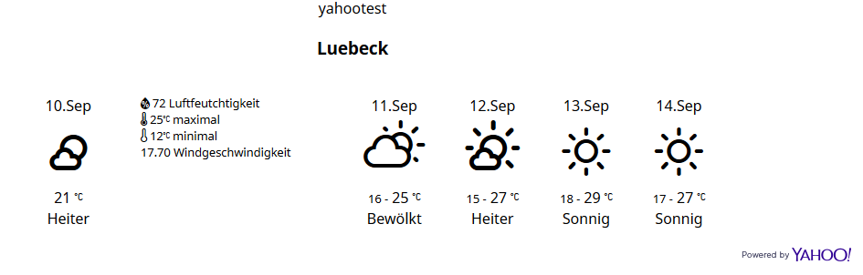

Contao Weather Extension
=============

Using one of multiple weather providers you can display the weather on your site

**Available platforms**

- [OpenWeatherMap](https://api.openweathermap.org) (An API key is required)

**Outdated platforms**

Still available in the settings and cache but without retrieval of new data. Will be removed in next version.

- [DarkSky](https://api.darksky.net/)
- [Firecast.io](https://api.darksky.net/)
- [yahoo Weather](https://query.yahooapis.com/v1/public/yql)

**ToDo**

- Migrate DarkSky to [Apple WeatherKit](https://developer.apple.com/weatherkit/get-started/) REST API
- Migrate Yahoo Weather to [Yahoo DSP API](https://developer.yahooinc.com/dsp/api/docs/traffic/targeting/weather-conditions.html)
- Add support for [Free Weather API](https://open-meteo.com/) (No API key required)
- Add support for https://www.weatherapi.com/

**Sponsoring**

Would you like to support this bundle? You are welcome to donate a developer hour at https://contao-themes.net/sponsoring.html.
Or book our [Contao Agency](https://pdir.de) for your next project.

**Acknowledgments**

- Thanks 🤗 [cnajjar](https://github.com/cnajjar) - this bundle is forked from https://github.com/cnajjar/contao-weather-get
- Weather icons 🌦 ☔ ☼ ☀ ☁ ⛄ from https://erikflowers.github.io/weather-icons/

## German

Mit diesem Contao Bundle kannst du Wetter Daten abfragen und ausgeben.

**Sponsoring**

Möchten Sie dieses Bundle unterstützen? Sie können gerne eine Entwicklerstunde unter https://contao-themes.net/sponsoring.html spenden.
Oder buchen Sie unsere [Contao Agentur](https://pdir.de) für Ihr nächstes Projekt.
